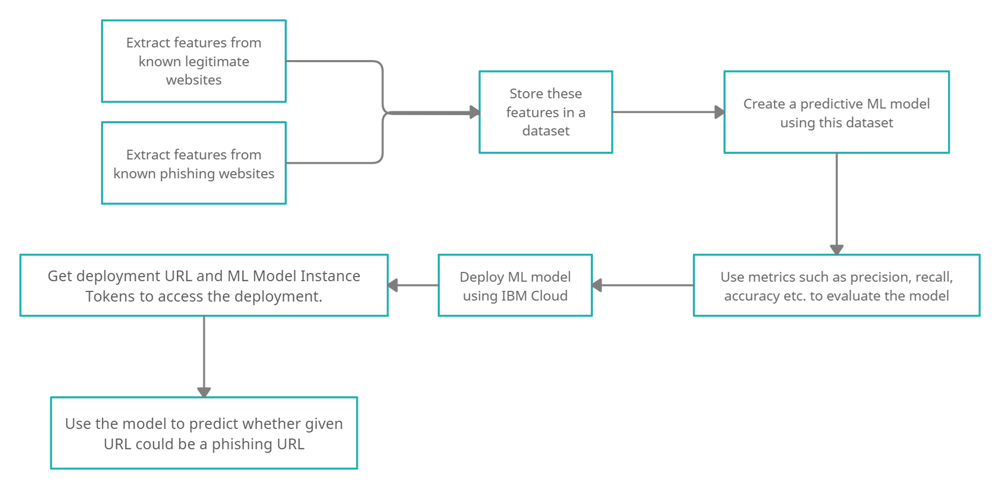
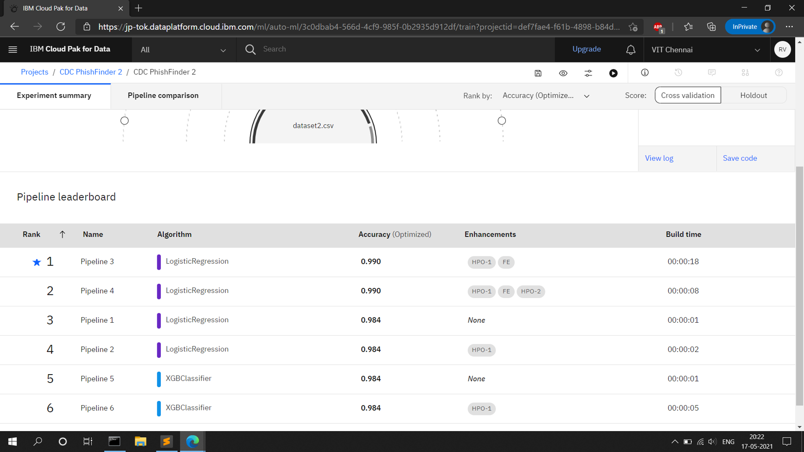
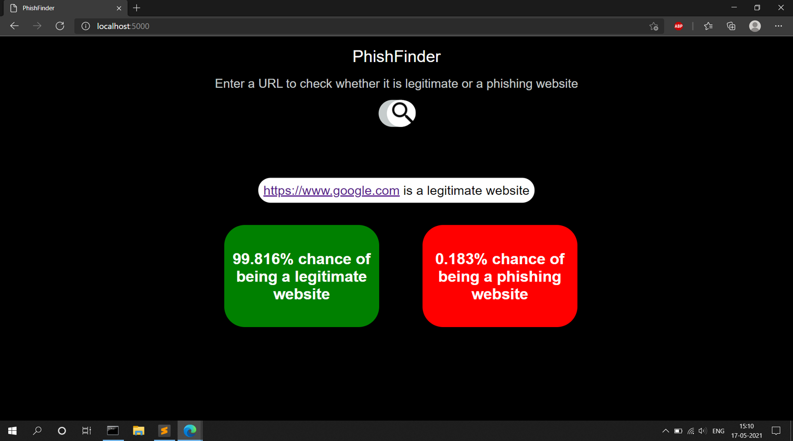
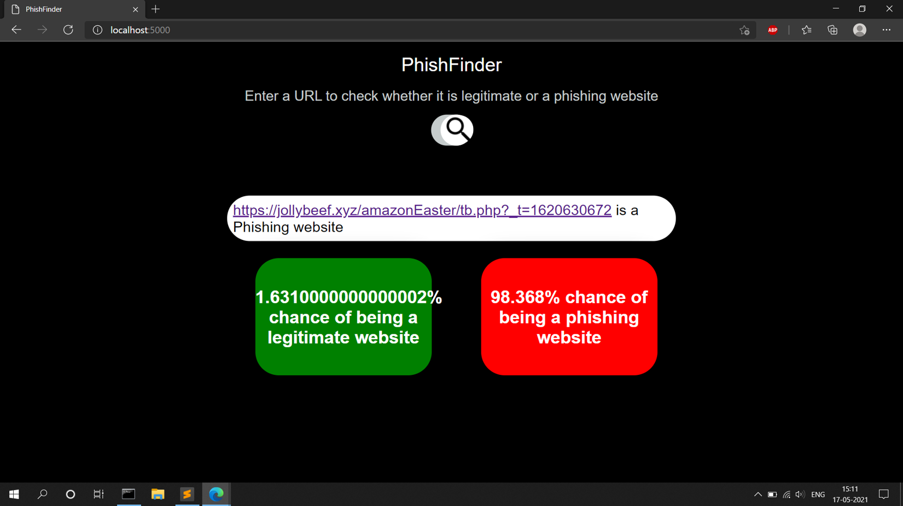

## Detecting Phishing Websites on IBM Cloud
PhishFinder - Detecting Phishing Websites using Machine Learning on [IBM Cloud](https://www.ibm.com/cloud) (Auto AI Feature)

### Objectives

  1. To create a dataset and apply necessary preprocessing followed by feature selection.
  2. To apply various machine learning models and compare them based on different metrics.
  3. To run all the algorithms in the selected cloud platform using IBM Cloud's AutoAI feature to validate the choose obtained previously.
  4. To implement and deploy the selected machine learning model onto a cloud based platform.
  5. To predict the probability of a website being legitimate or phishing based on the URL of the website.

### Flow Diagram

### IBM Cloud Implementation

Our project is implemented using the Free-Lite account of IBM Cloud. IBM cloud’s AutoAI feature is used to corroborate the results confirming that Logistic Regression is the best model for the use case.

### Deployment

The deployment URL and keys obtained from IBM Cloud are placed within the python code of the web application obtaining the following results.

### Reference
  - [Research Paper](https://www.researchgate.net/publication/277476345_Phishing_Websites_Features) - Rami Mustafa, Phishing Website Features, 2015 

